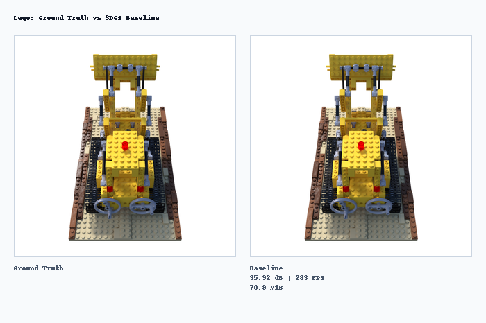
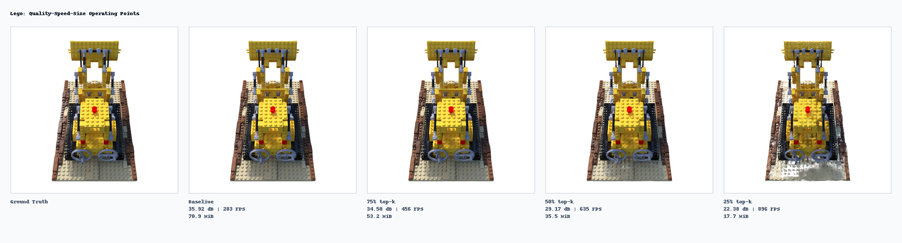
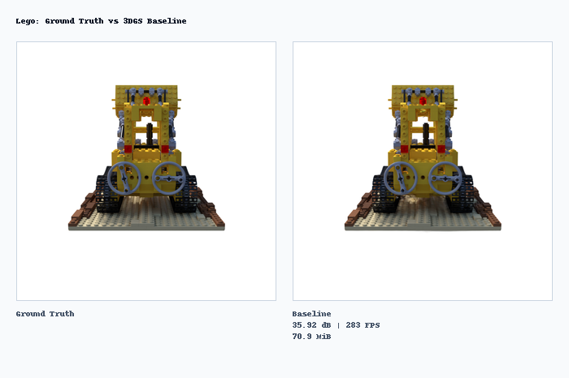
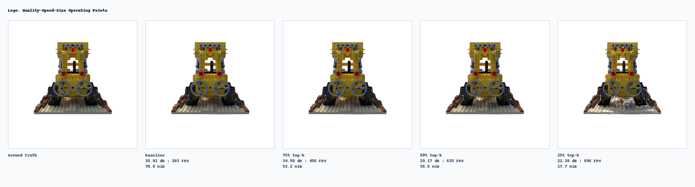
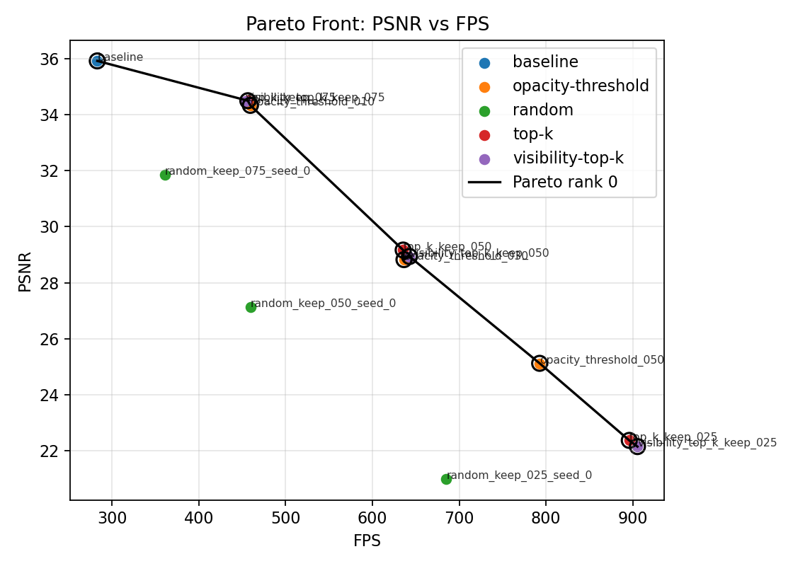
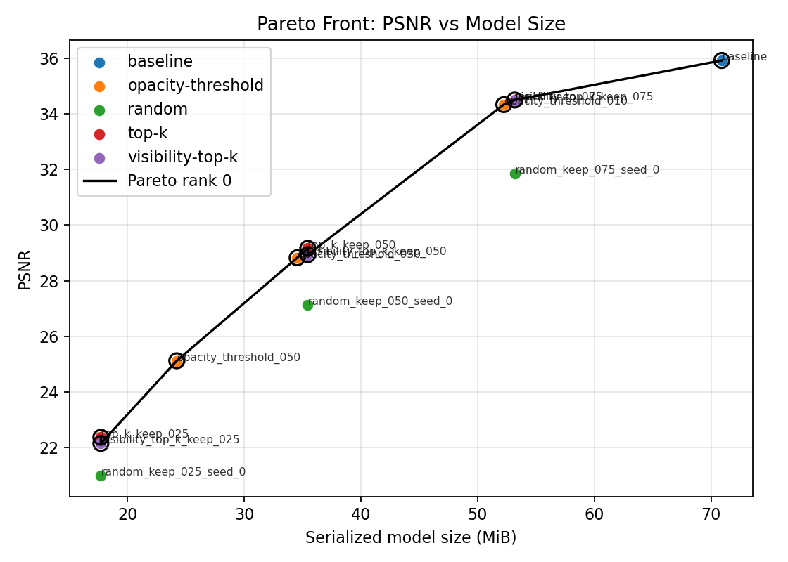
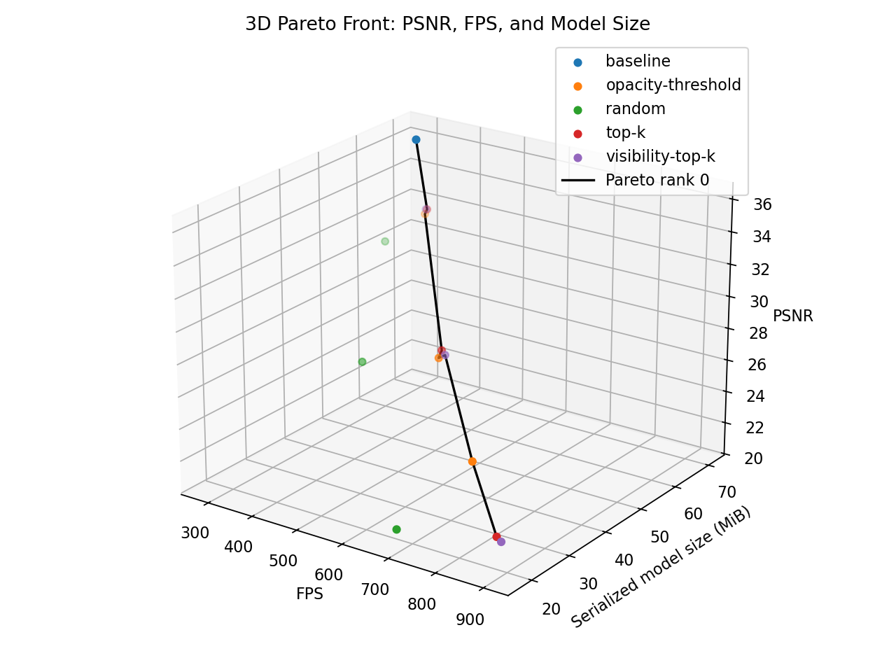
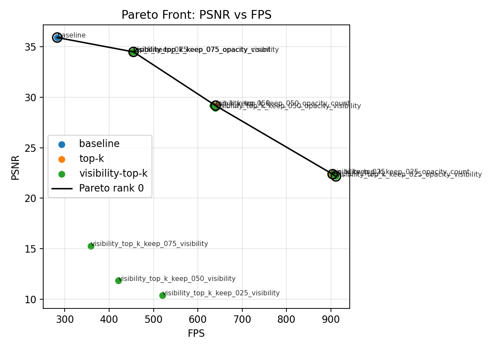
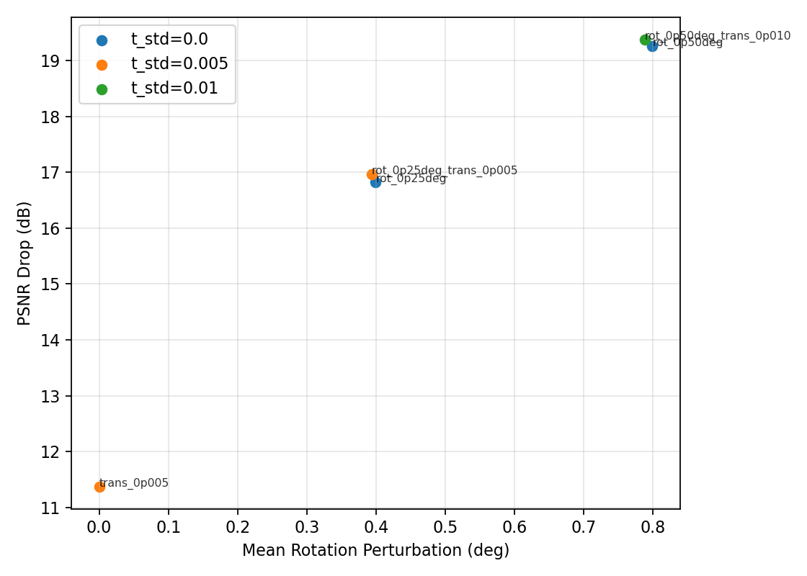
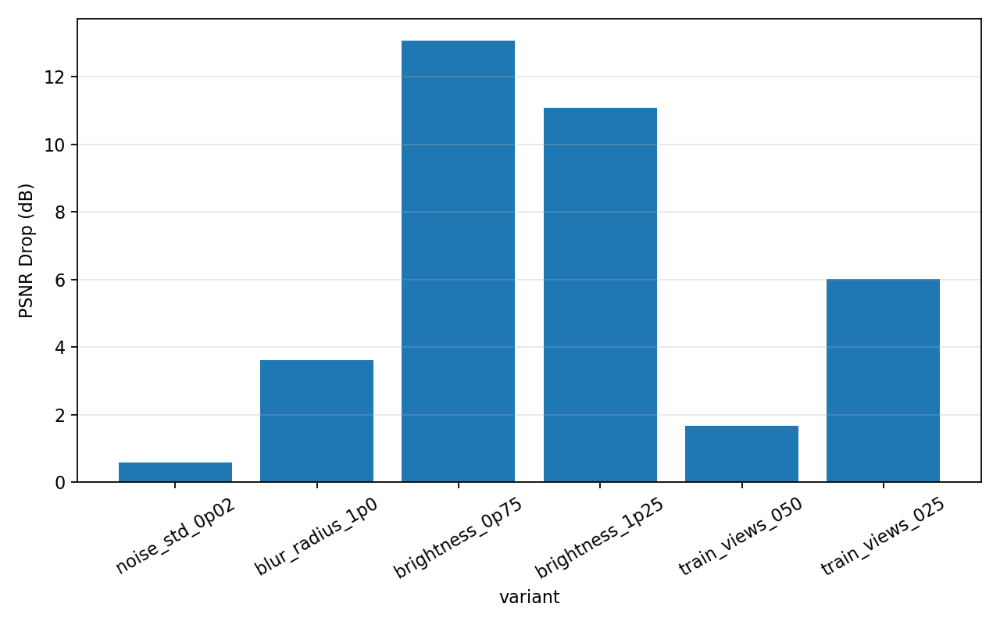

# Pareto-Splat

[Pareto-Splat](https://github.com/salomonhotegni/pareto-3d-splat) is a reproducible research pipeline for studying quality, speed,
and model-size trade-offs in
[3D Gaussian Splatting](https://github.com/graphdeco-inria/gaussian-splatting).
It wraps a pinned GraphDeCo baseline with held-out evaluation, CUDA profiling,
post-training Gaussian pruning, Pareto-front analysis, controlled robustness
studies, and presentation tooling.

Default objective vector:

```math
f(x) = [\mathrm{PSNR}(x), \mathrm{FPS}(x), -\mathrm{SizeMiB}(x)]
```

## Comparison Images

### Lego ground truth vs baseline render, frame 00000

[](images/lego_gt_vs_baseline_00000.png)

### Lego pruning operating points, frame 00000

[](images/lego_pruning_operating_points_00000.png)

### Lego ground truth vs baseline render, frame 00100

[](images/lego_gt_vs_baseline_00100.png)

### Lego pruning operating points, frame 00100

[](images/lego_pruning_operating_points_00100.png)


## Plots

### Pruning Pareto front: PSNR vs FPS

[](plots/pruning_pareto_psnr_vs_fps.png)

### Pruning Pareto front: PSNR vs model size

[](plots/pruning_pareto_psnr_vs_size.png)

### Pruning 3D Pareto front

[](plots/pruning_pareto_psnr_fps_size_3d.png)

### Importance ablation Pareto front: PSNR vs FPS

[](plots/importance_pareto_psnr_vs_fps.png)

### Pose sensitivity: PSNR drop vs rotation

[](plots/pose_psnr_drop_vs_rotation.png)

### Input sensitivity: PSNR drop by variant

[](plots/input_psnr_drop_by_variant.png)


## Videos

- [Lego ground-truth versus 3DGS orbit video](videos/lego_ground_truth_vs_3dgs.mp4)

